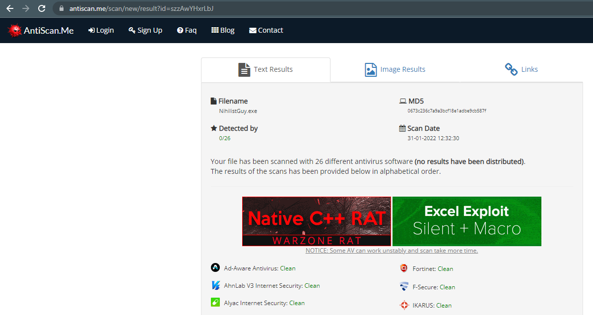

# NihilistGuy

A simple tool to dump lsass memory space with the ability to unhook NTDLL.dll and zero detection at the time of writing.

It will dump the lsass.exe as WindowsUpdateProvider.pod file and it will store it at C:\windows\Temp   
The purpose of this strategy is to bypass security controls that rely on monitoring the creation of dmp files.

Usage: Just execute the file from the CommandLine :)

